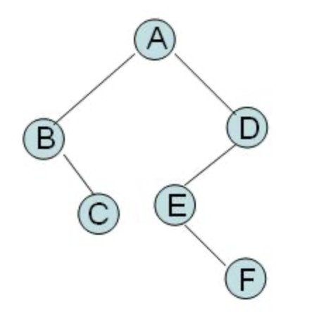

# 25TF2:文本二叉树
------

总时间限制: 1000ms 内存限制: 65536kB

### 描述

如上图，一棵每个节点都是一个字母，且字母互不相同的二叉树，可以用以下若干行文本表示:

```
A
-B
--*
--C
-D
--E
---*
---F
```

在这若干行文本中：

1) 每个字母代表一个节点。该字母在文本中是第几行，就称该节点的行号是几。根在第1行
2) 每个字母左边的'-'字符的个数代表该结点在树中的层次（树根位于第0层）
3) 若某第 i 层的非根节点在文本中位于第n行，则其父节点必然是第 i-1 层的节点中，行号小于n,且行号与n的差最小的那个
4) 若某文本中位于第n行的节点(层次是i) 有两个子节点，则第n+1行就是其左子节点，右子节点是n+1行以下第一个层次为i+1的节点
5) 若某第 i 层的节点在文本中位于第n行，且其没有左子节点而有右子节点，那么它的下一行就是 i+1个'-' 字符再加上一个 '*'


给出一棵树的文本表示法，要求输出该数的前序、后序、中序遍历结果

### 输入

第一行是树的数目 n

接下来是n棵树，每棵树以'0'结尾。'0'不是树的一部分
每棵树不超过100个节点

### 输出

对每棵树，分三行先后输出其前序、后序、中序遍历结果
两棵树之间以空行分隔

### 样例输入

```
2
A
-B
--*
--C
-D
--E
---*
---F
0
A
-B
-C
0
```

### 样例输出

```
ABCDEF
CBFEDA
BCAEFD

ABC
BCA
BAC
```

### 来源

Guo Wei